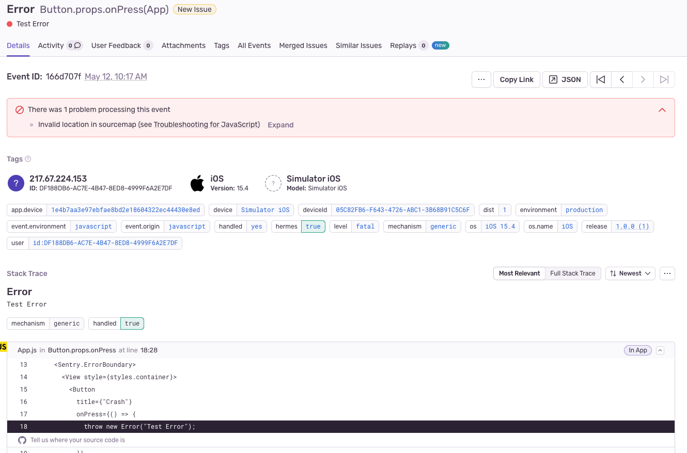
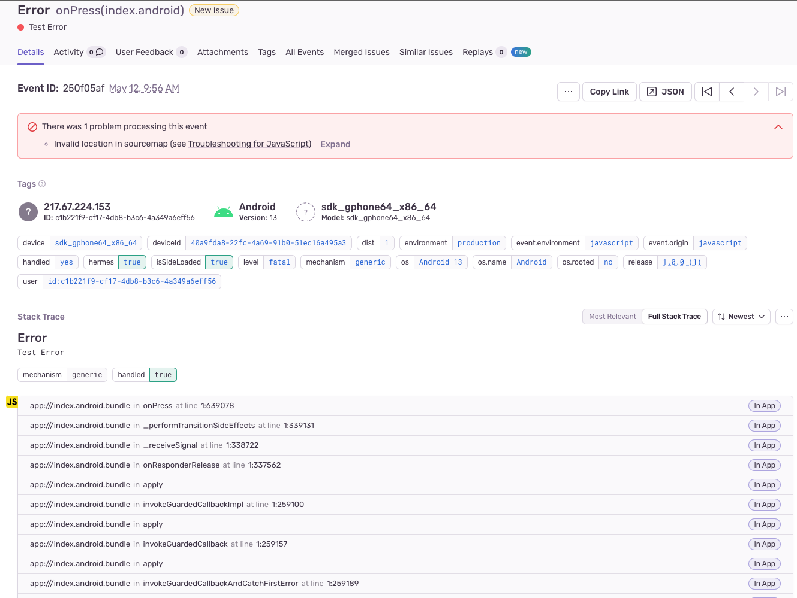

## Following steps have been taken to create a reproducible demo:

1. `$ expo npx create-expo-app --template bare-minimum`
2. `$ npm install "https://github.com/jongbelegen/sentry-expo.git#fix/update-sentry-android-support" --save`
3. `$ npm install @sentry/react-native --save`
4. Remove ios and android folder, also add them to .gitignore
    - Since they are generated on the spot in eas and also when running expo prebuild its not necessary to have them in
      the repo.
5. Configured in App.js with Sentry.init
6. Configured app.json with sentry-expo this will modify the build phases with sentry config

## Steps to reproduce
1. Install packages `$ npm install`
2. Make release build for ios and run on simulator `$ npx expo run:ios --configuration Release`
   - if this gives errors you can also use the expo service to build it. `$ eas build -p ios`
3. Make release build for android `$ eas build --local -p android`
   - This will ask you to automatically setup an EAS project, choose yes and follow the steps on default.
   - It will create an .aab file, you can transform this to an apk and install on a simulator with `$ bundletool build-apks --bundle=app.aab --output=app.apks` and `$ bundletool install-apks --apks=app.apks`

Everything is also prebuild, so you can also run the provided apps in the files folder on the simulator.

## Expected result
Seeing errors without sourcemaps problems.

## Actual result
The good thing is that sourcemaps do get uploaded!
I checked the dist and these seem to match on both platforms.

For ios I get the following errors:

You can see that the source is correct. But sentry still thinks something is up with the sourcemaps.

I ran sourcemaps explain and get the following:
```
✔ Fetched data for event: e99746ce8f2947f6b80b05490a854292
✔ Event has release name: com.jongbelegen.sentry-expo-minimal@1.0.0+1
✔ Event has a valid exception present
✔ Event has a valid stacktrace present
⚠ Exception is already source mapped and first resolved frame points to:

            onPress={() => {
              throw new Error("Test Error");
            }}
          />
          <Button
>           title={"Native Crash"}
            onPress={() => {
              Sentry.nativeCrash();
            }}
          />
          <Text>Open up App.js to start working on your app!</Text>
```

For android I get the following errors:

There is no source data available at all on android.

I ran sourcemaps explain and get the following:
```
✔ Fetched data for event: 250f05aff6334faeb12b6902e97ceda5
✔ Event has release name: com.jongbelegen.sentryexpominimal@1.0.0+1
✔ Event has a valid exception present
✔ Event has a valid stacktrace present
⚠ Exception is already source mapped and first resolved frame points to:

> [missing context line]
```

## Additional information
When running npx expo prebuild it will generate the ios and android folders. 
In here you can already inspect the end result what is gonna be build.
It seems to match with the documentation and the plugin is basically defined how its being done in Sentry wizard.

My hunch is that the new version might not work as much with how expo is rewriting frames?
The sentry-expo plugin being used can be found here https://github.com/jongbelegen/sentry-expo/tree/fix/update-sentry-android-support.
I have an idea that I know the internals of expo config and how its being build quit well, so if i can be of any more assistance, maybe through a videocall let me know!
